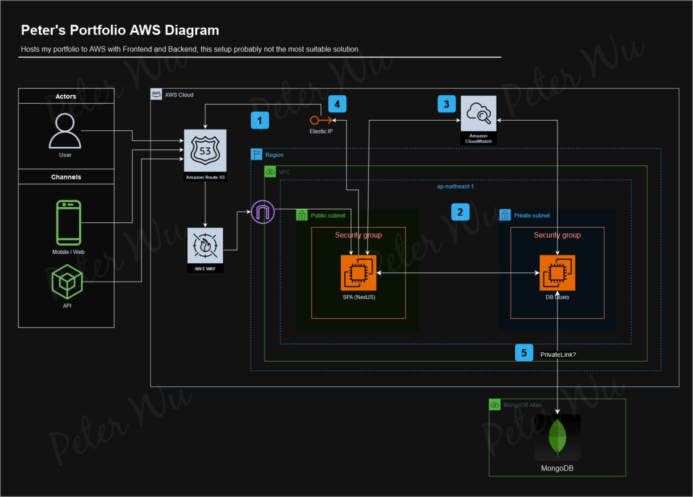

# Peter's Portfolio with AWS
Showcase the architecture of how my portfolio website hosted to AWS by diagram.

## AWS Diagram
 

---

### Description

1. All the connections must go through the internet gateway and Route 53 before connecting to the public subnet. AWS WAF is a default and free service that is activated for every AWS customer. It provides protection from attacks such as SYN/UDP Floods, Reflection attacks and other
layer 3/layer 4 attacks.

2. ELB is not necessarily needed since it is an SPA and data does not need to be reused.

3. All the logs can be stored in GA4 or handled inside the instance if needed. The advanced option can collect Logs from EC2 instances with CloudWatch. All the logs can be sustained in EBS without losing logs if EC2 is removed.

4. Elastic IP is optional to implement. Since this is only a personal SPA portfolio project. It is not necessary to fix an IP address. However, it is possible that the server will automatically restart irregularly. All the network settings will reset to AWS default settings and replace a new IP address, so this depends on different user's requirements

5. In your AWS VPC, set up a VPC endpoint for MongoDB Atlas using AWS PrivateLink. This will create an interface endpoint in your VPC that is connected to the MongoDB Atlas service.
Configure the necessary security groups and routing tables to allow traffic from your application to the MongoDB Atlas VPC endpoint. Update your application's DB query configuration to point to the MongoDB Atlas VPC endpoint instead of the public endpoint. (PrivateLink is a paid service, please estimate before using it!)

### Contribute
This is probably not the best and most suitable AWS architecture diagram for a portfolio website. I am sure there are many setups better than mine. I am pleased that everyone commented on my AWS diagram! Thank you for your help.